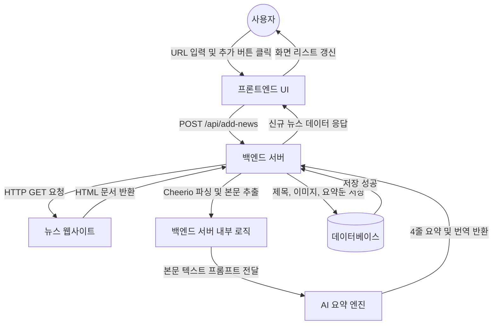
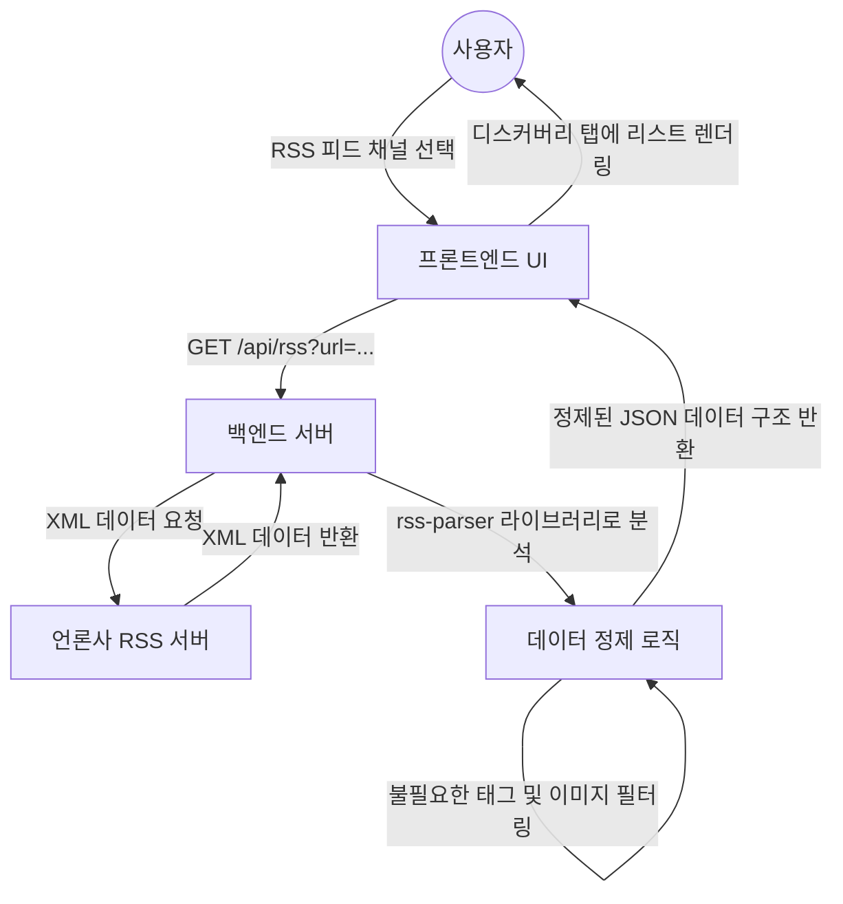

# Level 2: 주요 기능별 상세 흐름도 (Feature Details)

이 문서는 뉴스 큐레이션 플랫폼의 핵심 기능인 "뉴스 수동 추가"와 "RSS 피드 조회"의 상세한 프로세스를 나타냅니다.

## 2.1 뉴스 수동 추가 흐름 (Add News)

사용자가 URL을 입력하면 서버가 해당 URL을 스크래핑하고 AI를 통해 요약한 뒤 DB에 저장하는 과정입니다.

## 2.2 RSS 뉴스 검색 흐름 (Discover RSS)

시스템에 등록된 언론사들의 최신 RSS 피드를 실시간으로 불러와 사용자에게 보여주는 과정입니다.

