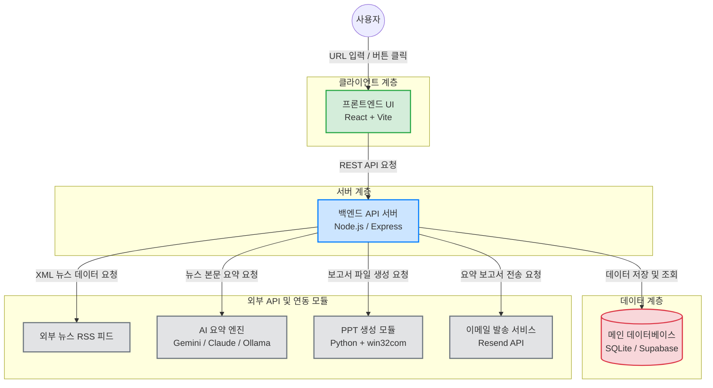

# Level 1: 통합 시스템 구조 (Integration)

이 문서는 AI Bongchae 시스템의 전체적인 통합 아키텍처를 보여줍니다. 사용자의 요청이 프론트엔드를 거쳐 백엔드와 외부 API 및 모듈로 어떻게 전달되는지 최상위 수준에서 표현합니다.

```mermaid
flowchart TD
    User((사용자))
    
    subgraph Client [클라이언트 계층]
        UI[프론트엔드 UI<br/>React + Vite]
    end
    
    subgraph Server [서버 계층]
        Backend[백엔드 API 서버<br/>Node.js / Express]
    end
    
    subgraph DataBase [데이터 계층]
        DB[(메인 데이터베이스<br/>SQLite / Supabase)]
    end
    
    subgraph External [외부 API 및 연동 모듈]
        RSS[외부 뉴스 RSS 피드]
        AI[AI 요약 엔진<br/>Gemini / Claude / Ollama]
        PPT[PPT 생성 모듈<br/>Python + win32com]
        Email[이메일 발송 서비스<br/>Resend API]
    end

    User -->|URL 입력 / 버튼 클릭| UI
    UI -->|REST API 요청| Backend
    Backend -->|데이터 저장 및 조회| DB
    Backend -->|XML 뉴스 데이터 요청| RSS
    Backend -->|뉴스 본문 요약 요청| AI
    Backend -->|보고서 파일 생성 요청| PPT
    Backend -->|요약 보고서 전송 요청| Email
    
    classDef client fill:#d4edda,stroke:#28a745,stroke-width:2px;
    classDef server fill:#cce5ff,stroke:#007bff,stroke-width:2px;
    classDef db fill:#f8d7da,stroke:#dc3545,stroke-width:2px;
    classDef external fill:#e2e3e5,stroke:#6c757d,stroke-width:2px;
    
    class UI client;
    class Backend server;
    class DB db;
    class RSS,AI,PPT,Email external;
```
