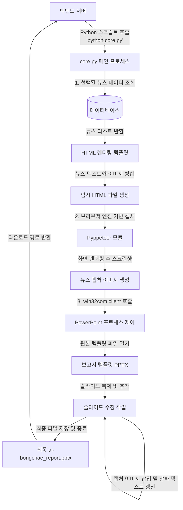

# Level 3: 핵심 모듈 상세 흐름도 (Module Details)

이 문서는 시스템 내에서 가장 복잡한 비즈니스 로직을 담당하는 **PPT 리포트 자동 생성 모듈**의 내부 동작 방식을 설명합니다.

## 3.1 PPT 자동 생성 모듈 로직 (Python Extractor)

좋아요를 누른 뉴스 데이터를 바탕으로 Python 윈도우 COM 객체를 이용해 PowerPoint 슬라이드를 자동으로 생성해주는 프로세스입니다.

